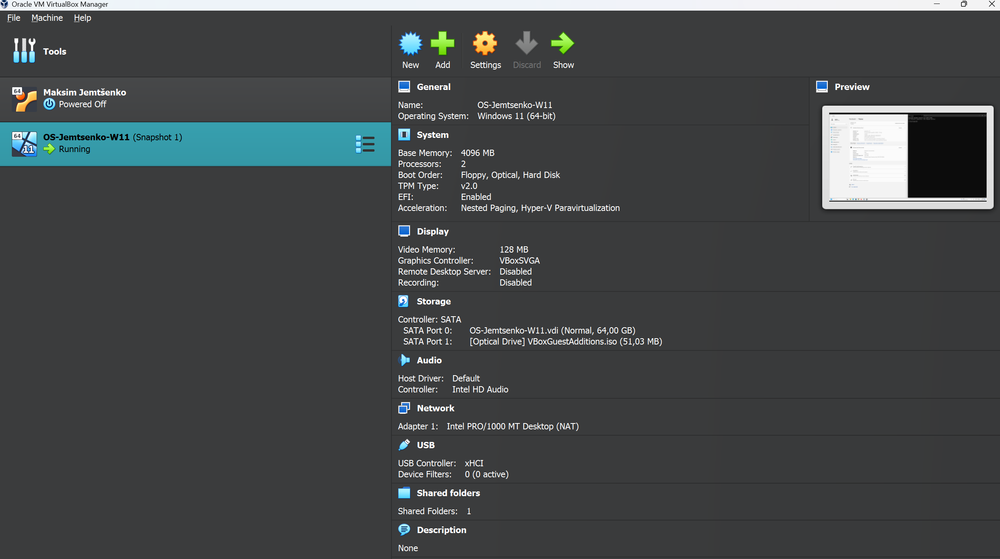
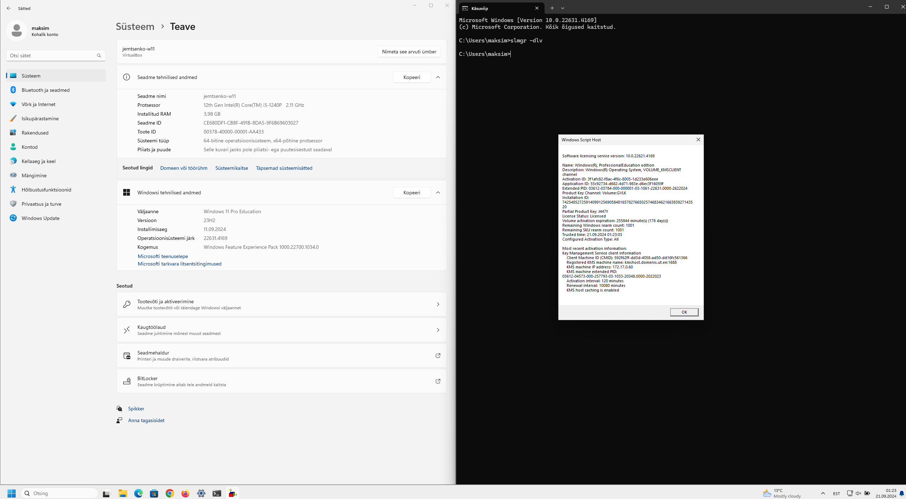

#Praktikum 1 aruanne

See oli minu esimene praktikum operatsioonisüsteemide kursusel. Praktikum kestis umbes 4-5 tundi, kuid suutsin kõik vajaliku valmis teha. Praktikumis paigaldasin oma arvutisse VirtualBox tarkvara, seejärel lõin uue virtuaalmasina ja installisin sinna Windows 11 operatsioonisüsteemi. Lisaks kohandasin ja seadistasin Windows 11 keskkonda vastavalt juhendi nõuannetele. Esitan ka tõestuse oma lahenduste kohta.

