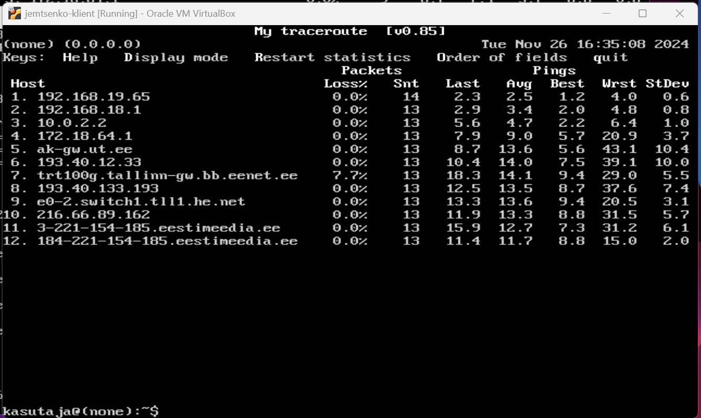

# Praktikum 10 - Sissejuhatus võrgutehnoloogiasse
10 praktikumis uurisime IP-pakettide marsruutimise protsessi läbi mitme võrguseadme. Peamine ülesanne oli luua virtuaalne võrk kolmest masinast: kahest ruuterist ja ühest kliendist, et tagada kliendile juurdepääs Internetile. Selle käigus tutvusime IP-aadresside, NAT, DHCP tööpõhimõtetega.

