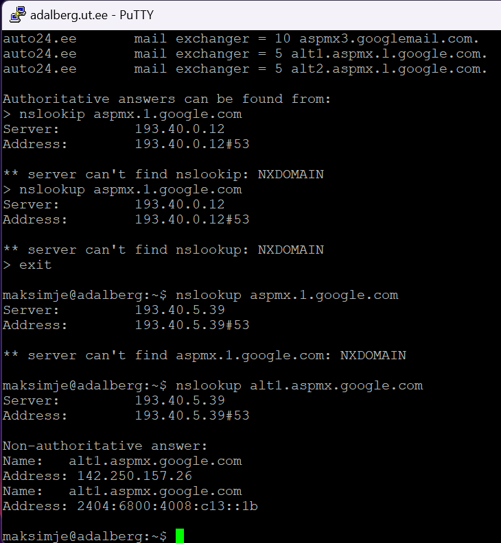
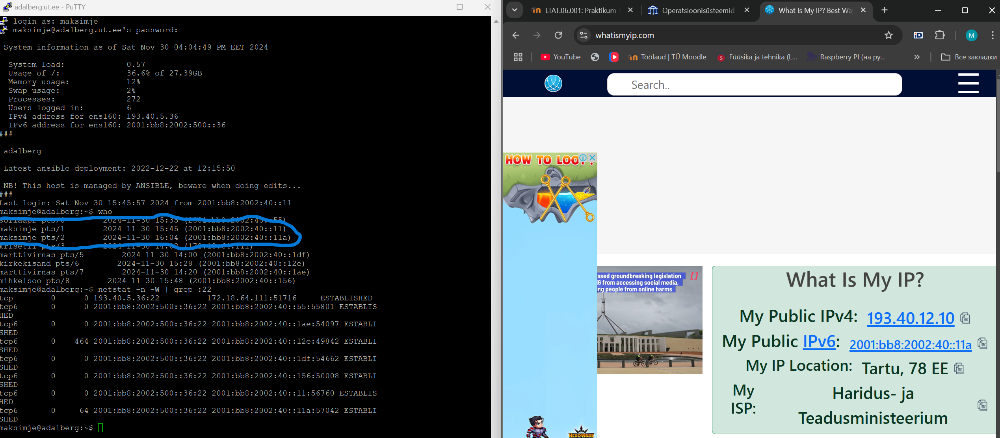

# Praktikum 11 - Rakenduskihi protokollid
Praktikumis 11 uurisime rakenduskihi protokolle, sealhulgas DNS, staatilisi nimesid, nimede eraldusvõimet ja DNS-kirjeid. Käsitleti ka TCP, HTTP ja SMTP põhitõdesid, nende kasutusalasid ja rolle võrgusuhtluses.

**Ülesanne 3b:** 404 Not Found on standardne HTTP-kood, mis tähendab, et server ei leidnud soovitud ressurssi. See tähendab, et antud juhul pole URL-i /sinunimi serveris oslab2.appspot.com olemas.

