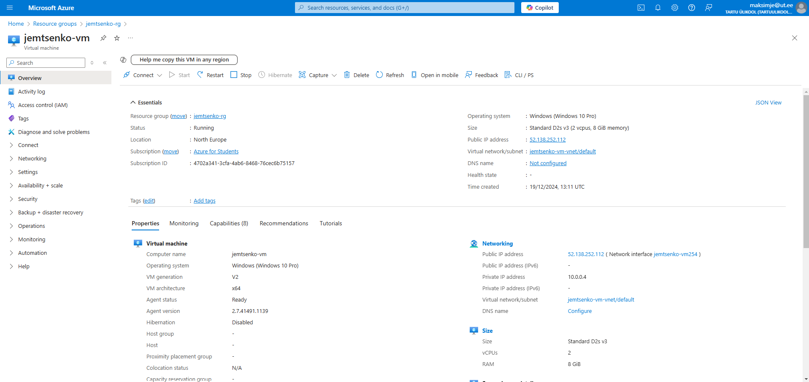
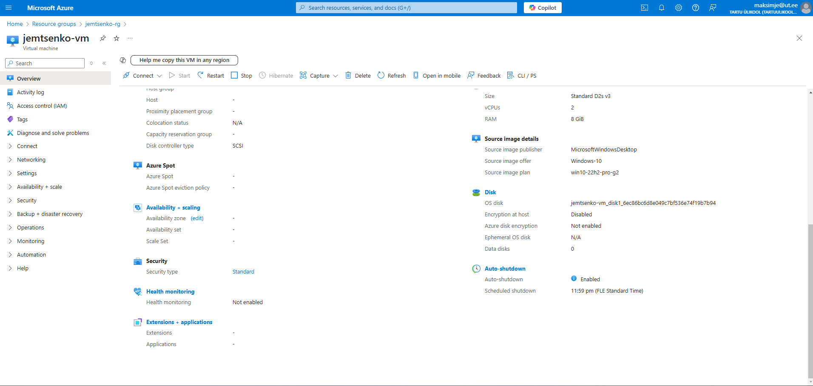
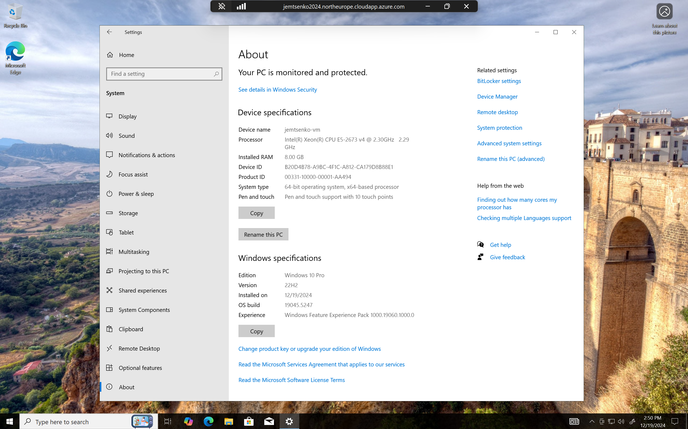
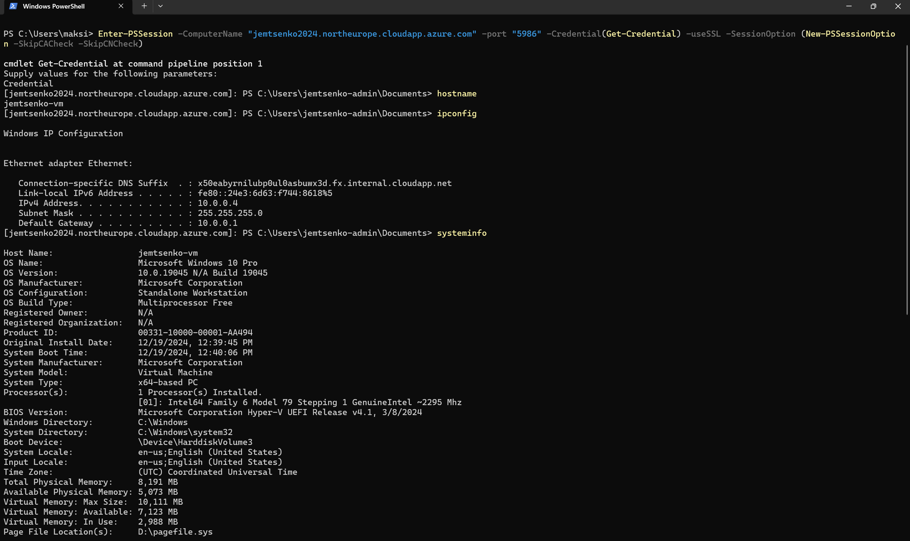
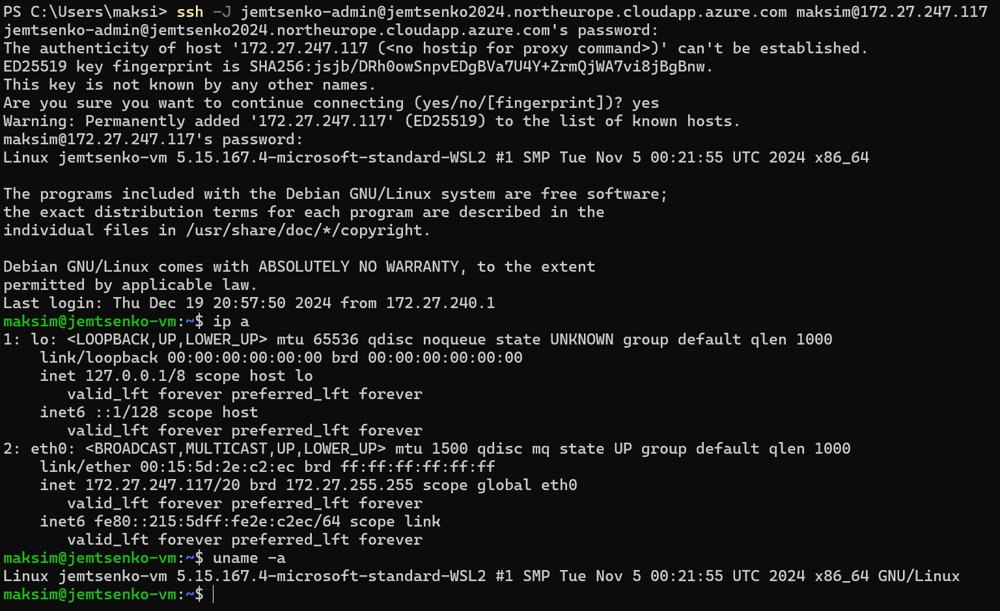
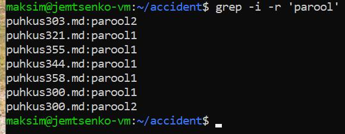

# Praktikum 14 - Azure VM ja WSL
Praktikumis uurisime erinevaid võimalusi, kuidas töötada Azure'is virtuaalmasinatega, ühendades PowerShelli ja SSH kaudu. Samuti said täidetud praktilised ülesanded virtuaalmasina ja WSL seadistamise ja kaugjuurdepääsu kohta.

