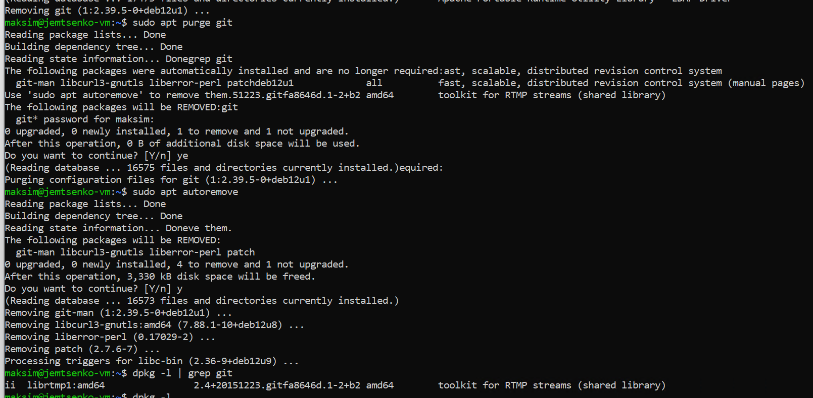
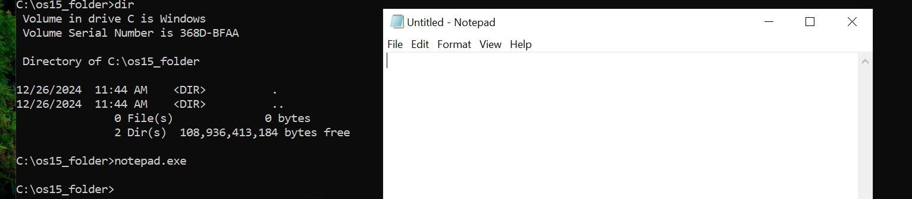
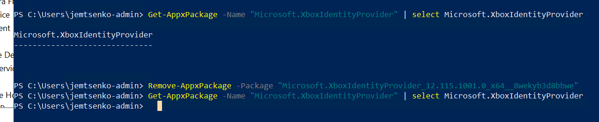
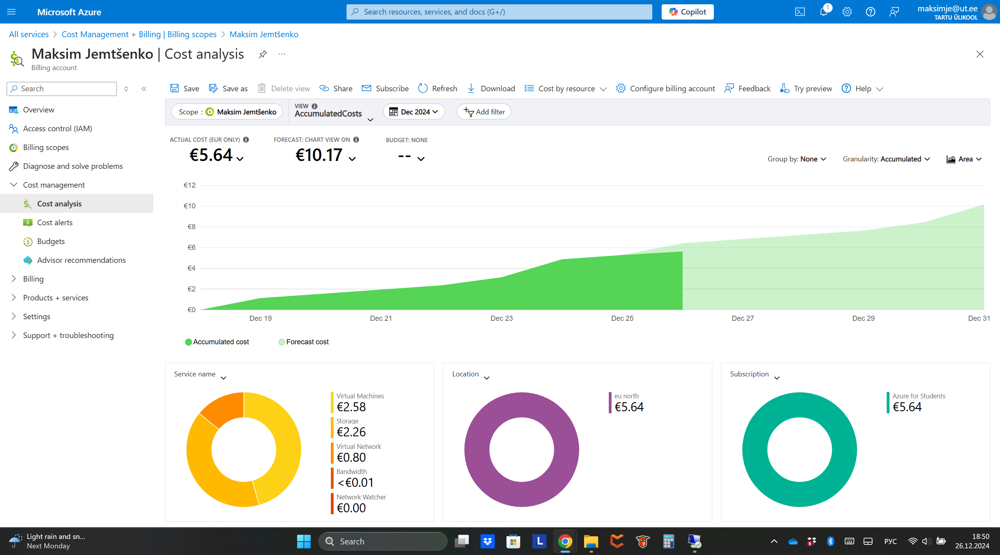

# Praktikum 15 - Teenused ja optimeerimine
Käesolevas praktikumis analüüsitsime ja optimeeritasime tarkvara ja süsteemiressursse nii Windowsi kui ka Linuxi keskkondades. Uurisime ja eemaldasime ebavajalikke tarkvarapakette, haldasime teenuseid ja keskkonnamuutujaid ning jälgisime Azure pilvekeskkonnas kulutatud ressursse.

*Ülesanne 3:* Käsu täitmisel käivitatakse fail kaustast, mis on "%Path%" muutujas esimene. Failide otsimise järjekorra määrab selles muutujas loetletud kaustade järjestus.

*Ülesanne 4:* EndesMode on teenus, mis kontrollib taustarakenduste käivitamist, võib -olla mõnede programmide või teenuste kontekstis, mis peaksid töötama taustal, isegi kui kasutaja ei suhtle nendega otse. Seda teenust kasutavad programmid saavad täita selliseid ülesandeid nagu andmete sünkroonimine, teatised, värskendused ja muud toimingud, mis teostatakse siis, kui kasutaja ei ole aktiivne sobivas rakenduses. Teenuse sulgemine toob kaasa tõsiasja, et taustrakendused keelatakse käivitada, ja nad ei saa oma ülesandeid taustal täita. See võib mõjutada mõne rakenduse tööd, mis sõltuvad taustrežiimist nende funktsioonide täitmiseks (näiteks failide sünkroonimine, teatiste saamine jne).

