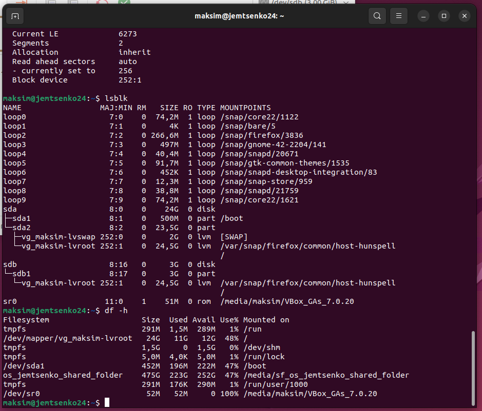
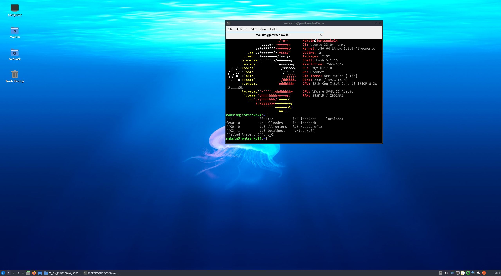
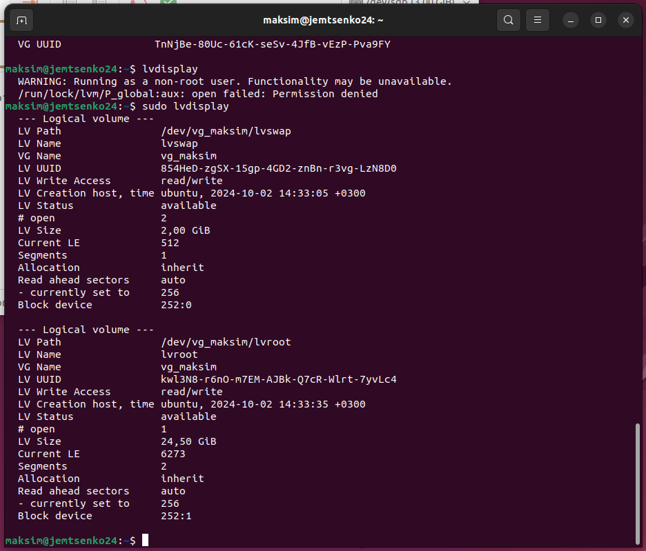
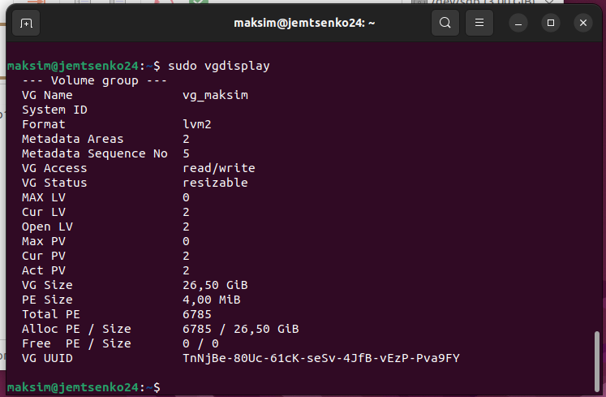

# Praktikum 3 - Ubuntu paigaldamine ja LVM seadistus
Käesolevas praktikumis paigaldasin Ubuntu 22.04 Desktopi, kasutades LVM (Logical Volume Management) ketaste vormindamist. Samuti katsetasin Lubuntut ja lisasin pildi vastavalt ülesande nõuetele, kuigi õppejõud näidises kasutab juhendi pilti, mitte seda, mida tudengid peavad esitama. Lõpus lisasin virtuaalmasinale täiendava kõvaketta ja suurendasin selle abil root partitsiooni.

