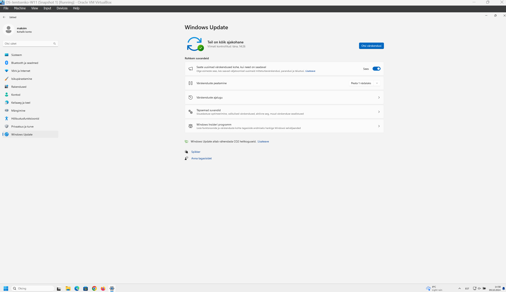
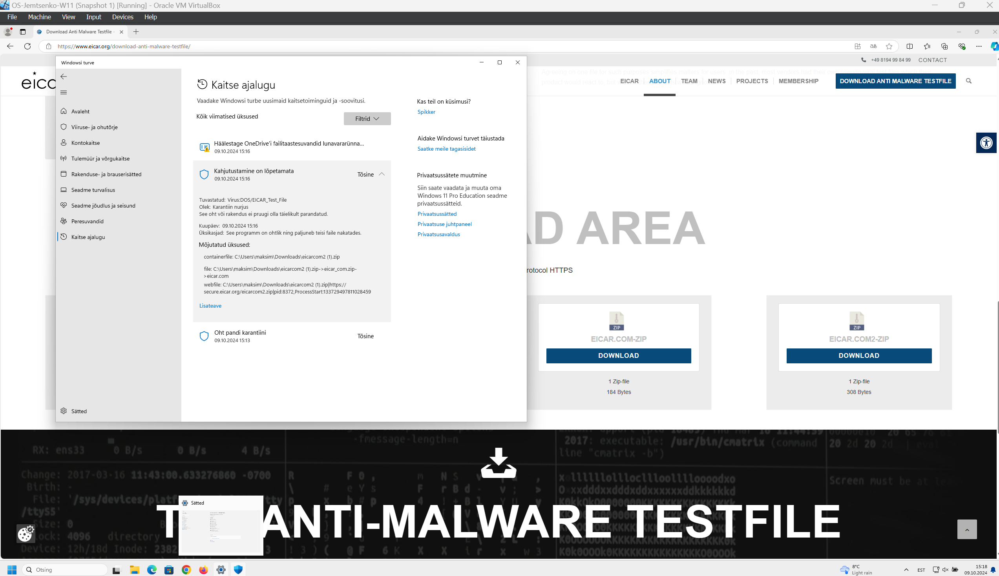
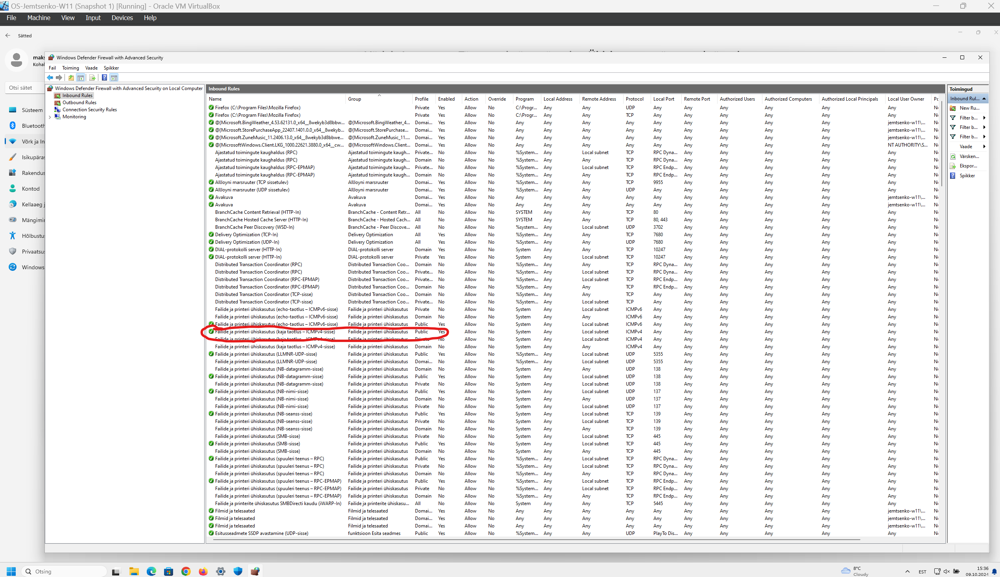
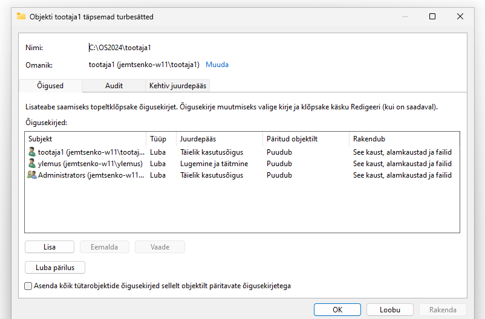
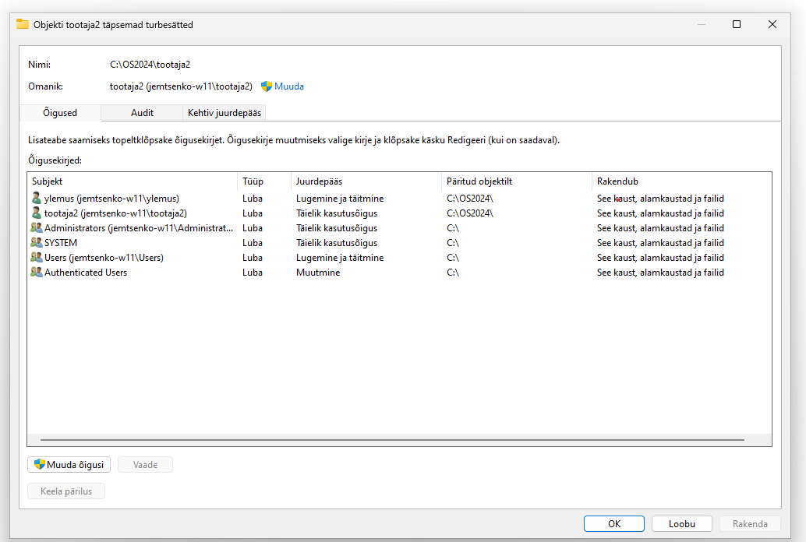
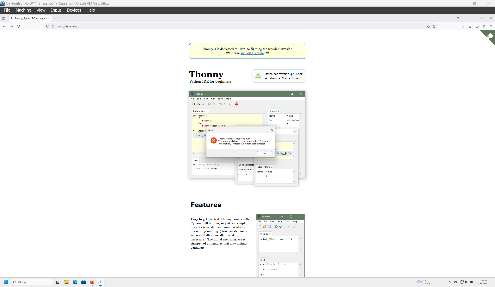
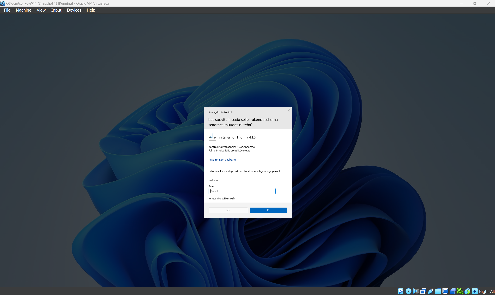
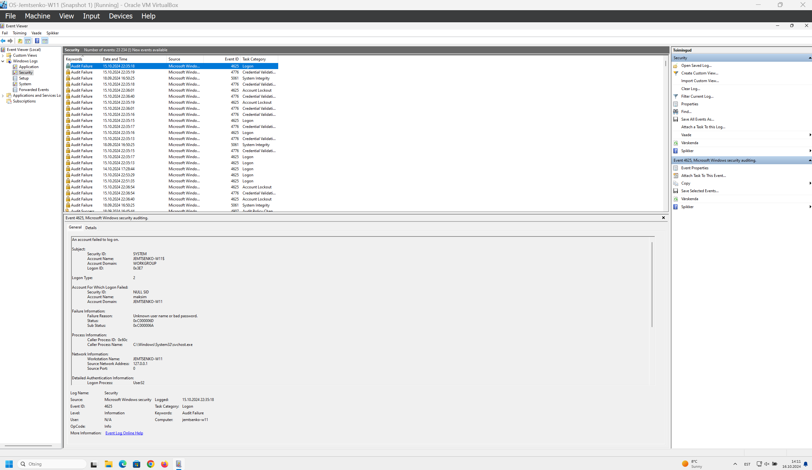
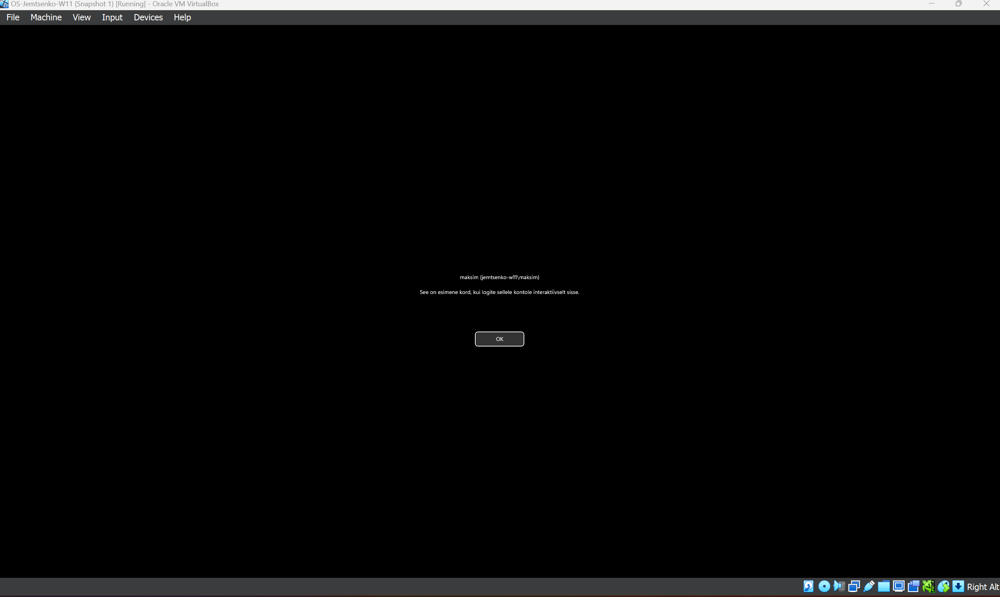

# Praktikumi 4 aruanne - Windowsi seadistamine ja turvalisus
Praktikumis seadistasin Windows 11 uuendused, viirusetõrje, tulemüür ja kasutaja õigused, et tagada süsteemi turvalisus ja efektiivne haldamine. Lõin ja haldasin kasutajakontosid, sealhulgas määrasin kaustadele õigused ning kohandasin Windows 11 privaatsussätteid vastavalt turvanõuetele.

**Ülesanne 4.4:** "Create symbolic links" jaoks on vaja SYSTEM'i õigusi ning ei piisa administraatori õigusi selleks, et vältida pahatahtlike või valede linkide juhuslikku loomist.
**Ükesanne 4.6:**Microsoft soovitab praktilise virtuaalmasina seadetes aktiveerida BitLockeri kõvaketta krüptimise, et kaitsta tundlikku infot seadme kadumise või varguse korral. See suurendab turvalisust, krüpteerides kogu andmekandja ning tagades, et ilma õigete volitusteta ei ole võimalik andmeid lugeda.

