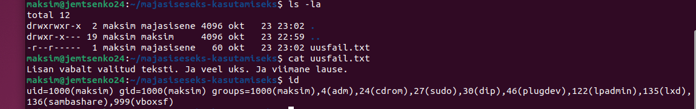
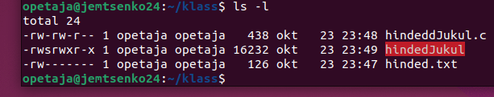
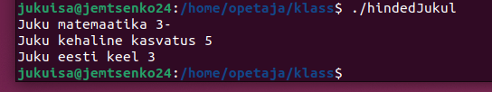

# Praktikum 5 - Failiõigused Linuxis

Praktilised ülesanded hõlmavad minimaalseid juurdepääsuõigusi linuxi süsteemide failidele ja kataloogidele, samuti erinevate atribuutide ja turvamehhanismide kasutamist, nagu setuid, setgid, sticky bit, ACL ja chattr. Ülesanded aitavad teil mõista, kuidas hallata õigusi ja turvalisi faile mitme kasutajaga keskkonnas.

*```peeter``` asemel ```maksim5```!*

*Ülesanne 2:* Skripti edukaks käivitamiseks on teil vaja nii käivitamis (x) kui ka lugemisõigust (r), et süsteem saaks faili esmalt lugeda ja seejärel käivitada.

*Ülesanne 3:* Turvalisus: Kui kasutaja loob faile, kuuluvad need vaikimisi talle ja tema isiklikule rühmale. See hoiab ära teiste kasutajate tarbetu juurdepääsu ja kaitseb juhuslike või soovimatute failimuudatuste eest, paindliku juurdepääsuõiguste haldamise, jagatud rühmade puhul väiksema veariski, konfigureerimise lihtsuse: igale kasutajale oma rühma andmine muudab juurdepääsu korraldamise lihtsamaks.

*Ülesanne 6:* Jah, setuidi kasutamine võib vähendada süsteemi turvalisust, kuna see võimaldab programmidel töötada teise kasutaja õigustega, sealhulgas privilegeeritud kasutajate õigustega. Kui selle atribuudiga fail käivitatakse, on seda käitaval protsessil faili omaniku õigused, mitte selle käivitanud kasutajal. See võimaldab programmil töötada selle kasutaja õigustega, kellele fail kuulub, mitte töötava kasutaja õigustega.

*Ülesanne 7:* maksim5 (faili omanik), opetaja (kausta omanik), root

*Ülesanne 8:* käsku ```getfacl``` tulemus: 
```
getfacl: Removing leading '/' from absolute path names
# file: home/opetaja/klass/hinded.txt
# owner: opetaja
# group: opetaja
user::rw-
group::---
group:direktor:rw-
mask::rw-
other::---
```

*Ülesanne 9:* Keegi ei saa muuta +i atribuudiga faili, sealhulgas root, enne, kui atribuut on eemaldatud. +i atribuudiga faili kustutamiseks tuleb esmalt eemaldada atribuut käsuga ```chattr -i``` ja seejärel saab faili kustutada ```rm``` või ```sudo rm``` abil.




