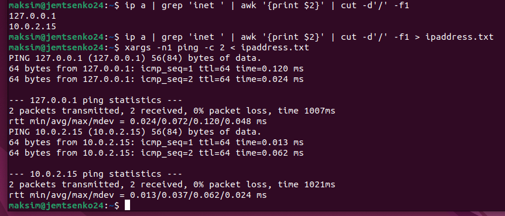

# Praktikumi 6 aruanne - Protsessid ja signaalid
Selles praktikas õppisime protsesse Linuxis haldama, sealhulgas nende käivitamist, peatamist ja lõpetamist. Oleme omandanud protsessikäsud, nagu ps loendi kuvamiseks, Ctrl+C väljumiseks, Ctrl+Z pausiks ning fg ja bg tausta ja esiplaani vahel vahetamiseks. Samuti saatsime protsessidele signaale kasutades kill ning õppisime sisendi ja väljundi juhtimist, sealhulgas ümbersuunamist operaatorite > ja | Levinud tavaks on kasutada nohupi, et kaitsta protsesse väljalogimisel ja failidega töötamisel katkestamise eest.
**Ülesanne 6.3 käsk** - ps -aux | grep daemon | awk '{for(i=11;i<=NF;i++) printf "%s ", $i; print ""}' | tr -s ' '

