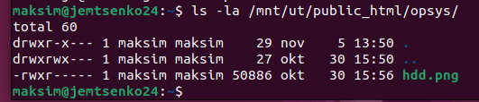
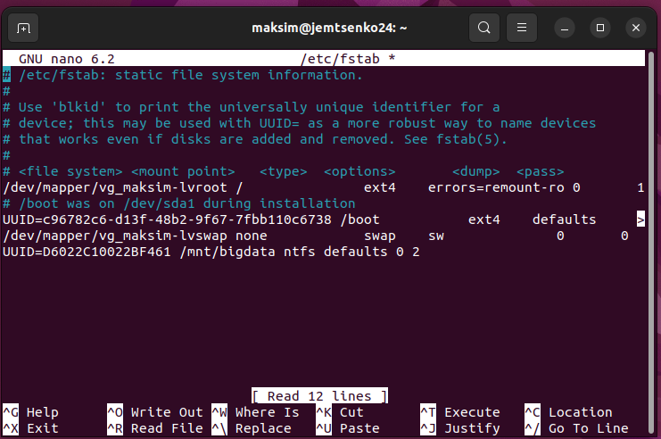

# Praktikum 7 - Haakimine
Käesolevas praktikumis uurisime kohalike ja võrguketaste kasutamist Windows 11 ja Ubuntu keskkondades. Windows 11-s töötasime kettahalduse tööriista ja ühendatud võrgudraividega ning Ubuntus meisterdasime graafilist utiliiti "Diskid" ja õppisime, kuidas süsteemi käivitumisel automaatselt ühendada ketas.

**Küsimus 1:** Andmekandja lähtestamine on vajalik selle esmaseks kasutamiseks või taaskasutamiseks pärast vormindamist ettevalmistamiseks. Erinevad operatsioonisüsteemid nõuavad meediumi õigeks äratundmiseks teatud lähtestamise märgistusskeeme (nt MBR või GPT). Sobiva lähtestamisskeemi valimine tagab, et andmekandja ühildub kasutatava süsteemiga. Initsialiseerimine soodustab ka kettal olevate andmete optimaalset levitamist ja haldamist. Initsialiseerimisprotsess võib tuvastada ka ketta füüsilisi probleeme või vigu ning märgistada vigased sektorid. See aitab vältida andmete kadumist ja parandada salvestuse töökindlust.

**Küsimus 2:** Mahutavus: MBR suudab töödelda ainult 2 TB kõvakettaruumi, samas kui GPT toetab kettad, mis on suuremad kui 2 TB.
Taastamine: GPT salvestab andmeid mitmesse kettapiirkonda koopiana taastamiseks teisese GPT varukoopiatabelina. Samas on MBR-i miinuseks see, et andmeid hoitakse ühes kohas ilma varundamiseta, mis suurendab andmete riknemise ja süsteemirikke tõenäosust.
Tehnoloogia ja ühilduvus: GPT saab kasutada täiustatud seadmetehnoloogiaid, samas kui MBR on mõeldud vähem arenenud süsteemide jaoks.

**Küsimus 3:** https://kodu.ut.ee/~maksimje/opsys/hdd.png

**Küsimus 5:** -o ro: haakib failisüsteemi režiimis "read-only".
-t auto: -t määrab haakimise failisüsteemi tüübi. Kui kasutatakse auto, proovib süsteem partitsiooni sisu põhjal automaatselt määrata failisüsteemi tüübi. 

**Küsimus 6:** Ubuntu auto parameeteri asendas ntfs väärtusega.

