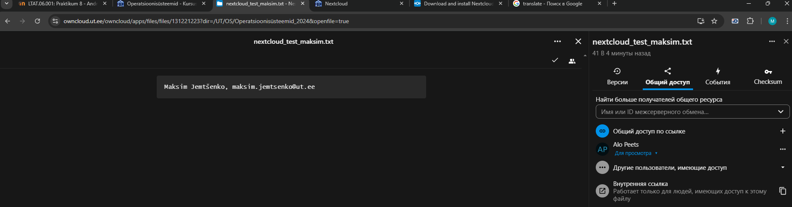

# Praktikum 8 - Praktikum 8 - RAID ja andmete varundamine
Praktikas õppisime RAID-i põhitõdesid, konfigureerisime RAID-massiivi ja testisime selle toimivust. Lõime erinevad RAID-tasemed, et mõista nendevahelisi erinevusi ning hinnata nende jõudlust ja veataluvust.

